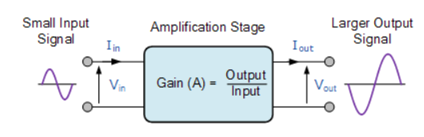
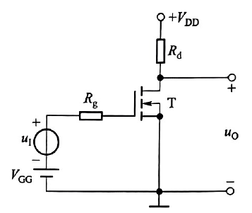
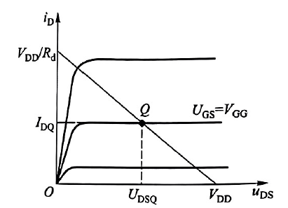
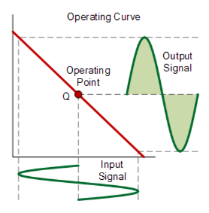
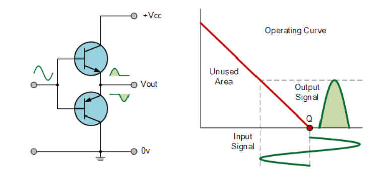
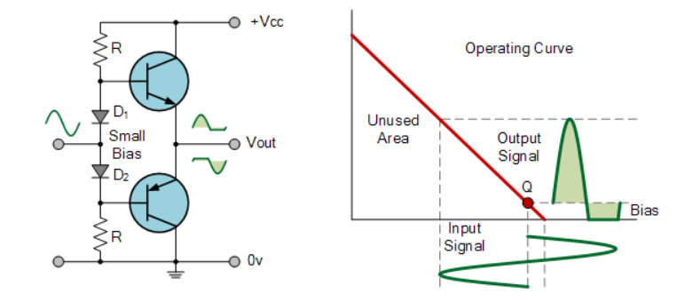
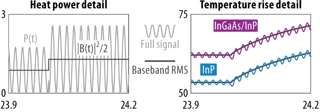

## 0 引子

半导体器件的电热耦合通常包含两个方面：一是器件的产热由其电学特性和工作状态决定，二是器件的电学性能会受到温度的影响。因此，电学与热学之间并非单向的上下游关系，而是相互影响、彼此耦合的。

不过，热学研究往往会简化“热源”，例如假设矩形区域内均匀发热，或采用稳态热源；电学研究则往往会简化“温度”和“传热过程”，例如将整个器件视为等温体，或直接用环境温度代替器件温度。这些简化各有其适用条件，但也可能忽略实际电热耦合中的一些细节。找出两类研究之间尚未衔接的环节，往往就能发现值得探索的问题。站在热学研究的角度，要弄清实际的产热分布，首先就需要了解器件如何工作。

因此，开启“Transistor”系列的目的，就是梳理不同器件在实际应用中的工作方式，以便更准确地理解其产热行为。本文从 GaN HEMT 的典型应用——射频功率放大器（RF PA）入手，介绍 PA 器件的工作方式及其产热特征。

## 1 PA的目的

无论是通信基站还是雷达，射频发射端都需要将信号以电磁波的形式发射出去，用于信息传输或目标探测。

为了实现这一点，人们采用**载波（Carrier Wave）**承载信息。载波频率的选择与传播特性、可用带宽和天线尺寸等因素有关。我们常说的 6 GHz、100 MHz 等频率，往往指的是载波频率，而不是所传输信息对应的基带信号频率。

有了载波，还需要将信息嵌入其中，这一过程称为**调制（Modulation）**。简单来说，就是让载波的幅度、频率或相位随信息变化，分别对应调幅、调频和调相。以脉冲雷达为例，可以通过控制载波的幅度包络形成射频脉冲，再利用回波的时延等特征获取目标信息。更复杂的射频系统还会组合使用不同的调制方式。

经过调制的射频信号通常功率较小。为了满足传输距离或探测范围的要求，还需要在满足失真要求的前提下提高其功率，这就需要**功率放大器（PA, Power Amplifier）**。如下图所示，PA 将较小的输入信号放大，使其具备驱动天线发射所需的功率。

## 2 PA的结构

为了理解放大过程，可以先从最简单的电阻负载共源放大电路入手。在合适的偏置和信号范围内，晶体管的漏极电流变化与栅源电压变化近似成正比。将输入小信号叠加到栅极偏置上，源极接地，再通过电阻 $R_d$ 将漏极接至直流电源，就可以把漏极电流的变化转化为漏极电压的变化，实现电压放大。其结构如下图所示。实际 RF PA 的负载网络通常更复杂，但这个电路有助于理解基本原理。

在这个电路中，静态栅源电压为 $U_{GS}=V_{GG}$，漏极回路满足 $V_{DD}=i_D R_d+u_{DS}$。这一方程在晶体管的输出特性图中对应一条斜率为负的直线，称为**负载线**。$U_{GS}=V_{GG}$ 对应的输出特性曲线与负载线的交点，就是静态输出工作点。当栅压随输入信号变化时，漏极电流随之变化，工作点便沿负载线来回移动；对应的漏极电压变化范围，就是输出电压信号的摆幅。

要放大完整的输入波形，还需要选择合适的静态工作点和输入幅度，使栅源电压在整个信号周期内都高于阈值电压 $V_{th}$，同时避免输出摆幅过大导致失真。此时，器件在整个周期内持续导通，这种工作方式称为 **Class A（A 类）**。它可以用单个功率管完成全周期放大，其输入输出特性如下图所示：

## 3 PA的分类

回到 PA 的目的：在满足失真要求的前提下提高信号功率。除了增益和线性度，效率也是评价 PA 的重要指标。**功率附加效率（PAE, Power Added Efficiency）**用输出射频功率与输入射频功率之差，除以消耗的直流功率，表示直流功率转化为新增射频输出功率的比例：
$$
PAE=\frac{P_{out}-P_{in}}{P_{DC}}
$$
其中，$P_{out}$、$P_{in}$ 和 $P_{DC}$ 分别为平均输出射频功率、平均输入射频功率和平均直流供电功率。若将 PA 的损耗功率记为 $P_{loss}$，则由能量守恒 $P_{in}+P_{DC}=P_{out}+P_{loss}$ 可得：
$$
PAE=1-\frac{P_{loss}}{P_{DC}}
$$
也就是说，损耗功率占直流供电功率的比例越大，PAE 就越低。这些损耗最终主要转化为热；若以整个 PA 为分析对象，损耗还可能包括供电和匹配网络等部分的损耗。

若器件以 **Class A** 方式工作，即使没有交流输入信号，也存在静态电流和相应的功耗。降低这部分功耗，是提高效率的一条思路。一个直观的方法是将静态工作点设在 $U_{GS}=V_{th}$ 附近，使理想情况下的静态电流为零。此时，器件只在输入信号的半个周期内导通，这种工作方式称为 **Class B（B 类）**。在典型的推挽电路中，可以用两个功率管分别放大正、负半周，再合成为完整输出；射频电路也可以利用谐振负载提取基波输出。Class B 的示意图如下：

**Class B** 具有较高的效率，但在推挽电路中，正、负半周交接处可能出现交越失真。将静态栅源电压设在略高于 $V_{th}$ 的位置，可以让两个功率管在交接区域内都有一段导通时间，从而减轻交越失真。这种工作方式称为 **Class AB（AB 类）**，在效率与线性度之间取得折中，其示意图如下：

上述分类依据的是器件在一个周期内的**导通角**：Class A 为 $360^\circ$，Class B 为 $180^\circ$，Class AB 则介于两者之间。一般而言，导通角越大，漏极电流覆盖的周期越完整，但静态功耗也往往越大，效率随之受到限制。

## 4 PA的产热过程

从以上介绍中，可以提炼出两个与产热分析直接相关的特点：

1. PA 器件的工作状态是动态的，其瞬时电压和电流在一个载波周期内不断变化；
2. PA 有不同的工作类别，按导通角可分为 Class A、Class AB、Class B 等，对应不同的电流波形和功耗特征。

先看第一个特点。在 GaN HEMT 的产热分析中，通常不会逐一解析每个载波周期内的温度变化。原因在于载波频率很高，例如 10 GHz 对应的周期仅为 100 ps，而器件在这一时间尺度内的温度响应通常较弱。简单来说，功率虽然变化很快，温度却难以同步跟随。因此，在关注较慢的温度变化时，常用载波周期内的平均产热功率作为热源输入。下图展示了 Vermeersch 在 2022 年对 RF 器件进行的瞬态热仿真：在该算例中，载波周期内的温度波动远小于信号包络变化引起的温度波动。

不过，即使总产热功率可以取周期平均值，仍有一个问题值得关注：平均后的**产热分布**是什么样的？总功率相同，并不意味着热量在器件内部的空间分配也相同。假设产热分布遵循以下“双热源模型”：

$\boxed{ P_{\rm hs1}(t)=\min[V_{DS}(t),V_{Dsat}]\,I_{DS}(t) }$

$\boxed{ P_{\rm hs2}(t)=\max[V_{DS}(t)-V_{Dsat},0]\,I_{DS}(t) }$

那么，在该模型下，问题就转化为：一个载波周期内，$P_{\rm hs1}$ 与 $P_{\rm hs2}$ 的平均值分别是多少，两者的比值又是多少？在热源区域固定、且可以忽略载波周期内温度波动的条件下，可以用这两个平均功率构建等效的空间产热分布。若信号包络仍随时间变化，则还需要保留平均热源随包络的变化。这样既能简化计算，也能保留实际工作状态对产热分布的影响。

再看第二个特点：两部分热源的功率比例是否也与工作类别有关？下表给出了一组理论计算结果。在这组计算条件下，Class A 的平均总产热功率虽然更大，但第二热源的相对占比较低；从 Class A 到 Class B，$\overline{P}_{\rm hs2}/\overline{P}_{\rm hs1}$ 逐渐增大。这说明，工作类别不仅影响总产热功率，也会影响热量在两个热源区域之间的分配。

|   工况   | 平均 $P_{\rm hs1}$ | 平均 $P_{\rm hs2}$ | $\overline{P}_{\rm hs2}/\overline{P}_{\rm hs1}$ |
| :------: | :-------: | :-------: | :-------: |
| Class A  | 18.09 mW  | 22.98 mW  |   1.27    |
| Class AB |  6.22 mW  | 12.20 mW  |   1.96    |
| Class B  |  2.20 mW  |  5.38 mW  |   2.45    |
